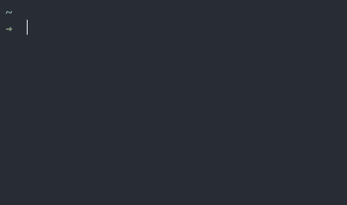
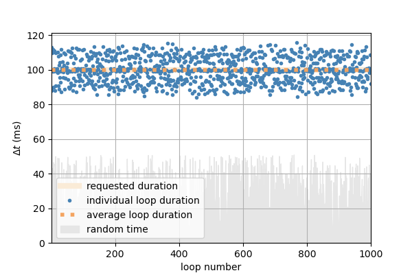
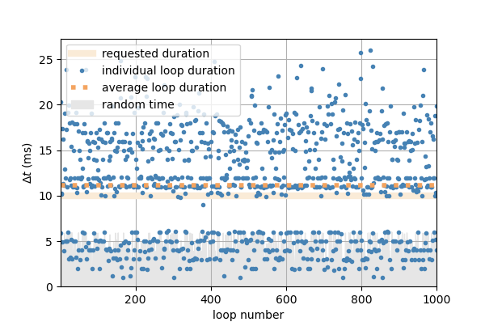

# General information

**oclock** is a Python 3 package that provides various timing tools :

- The `Timer` class:
    * can be used as a regular timer with `pause()`, `stop()`, etc. methods,
    * can also be used to make loops of constant duration independently of loop contents (using the `checkpt()` method), without drift,
    * is immediately modifiable and/or cancellable in threaded environments (with cancellable sleeping times).

- The `Countdown` class starts a GUI countdown timer.

- The `parse_time()` function returns a `datetime.timedelta` from a time string (e.g. `':2:25'`).

- The `measure_time()` and `measure_duration()` functions are context managers for measuring time and execution times / time uncertainty of encapsulated commands.

# Quick start

## Install

```bash
pip install oclock
```

## Timer

The `Timer` class is mostly designed to create loops of constant duration without drift, while allowing immediate modification/cancellation (sleep time interruption) in threaded environments. It can also be used as a regular timer.

### Constant-duration loops

The most basic use of the `Timer()` class in Python code to create a loop of constant duration is:
```python
from oclock import Timer
timer = Timer(interval=2)  # Loops will be of total duration 2 seconds
while condition:
    my_function()  # can be of any duration between 0 and 2 seconds
    timer.checkpt()
```
The `checkpt()` method waits the adequate amount of time to make the loop of constant duration, without drift (using a target regularly spaced in time).

Note that if *my_function()* takes longer to execute than the required time interval, the Timer class does not try to compensate the extra time by making the next loop shorter. It just aims at making the total duration of the next loop be the requested interval again (see *Behavior when interval is exceeded* section below).

### Immediate modification/cancellation

The timer is also modifiable (change time interval) and cancellable in real time (i.e. even when the timer is in a `checkpt()` waiting phase). To do so, it must be accessed by another thread that runs concurrently. For example:

```python
from oclock import Timer
from threading import Thread

def user_input(exit_event, timer):
    """Command line input to change the time interval of the timer or exit."""
    while not timer.is_stopped:
        a = input()
        try:
            dt = float(a)
        except ValueError:  # immediately cancel timer & exit all loops/threads
            timer.stop()
        else:               # immediately change interval to input value
            timer.interval = dt

timer = Timer(interval=2)

# CLI to interact with timer
Thread(target=user_input, args=(exit_event, timer)).start()

while not timer.is_stopped:
    my_function()
    timer.checkpt()
```

See example.py for a more detailed, working example. The program can be started with `python -m example` (e.g. from the root of the *oclock* repository).

Note that the `Timer` object can also be paused, resumed, stopped and reset using the corresponding methods (see *Regular Timer* paragraph below), but these methods have not been tested yet in a cancellable/threaded environment (*TO DO*).

### Regular Timer

Although not its main purpose, the `Timer` class can be used as a regular chronometer with the following methods (no need to be in a threaded environment, although the methods below whould work and be cancellable in a threaded environment):

```python
from oclock import Timer

# The timer starts counting time immediately upon instantiation.
timer = Timer()

# Temporarily stop counting time
timer.pause()
timer.resume()

# Stop and restart timer completely
timer.stop()
timer.reset()  # can be called without calling stop() first

# At any time, the elapsed time and total pause duration can be accessed with
timer.elapsed_time
timer.pause_time
```

**Important Note**: Do not use the `checkpt()` method after a `pause()` call if not in a threaded environment, this will cause the program to be in a perpetual waiting state. In a threaded environment, call `resume()` to unpause.

### Details

See *Timer Class details* section below for all methods, properties and attributes and the *Development* section below for accuracy information.

## Countdown GUI

A simple graphical countdown timer based on the `Timer` class. It can be used either as a python main program from a shell, or as a function in Python code or console.



From a terminal:
```bash
python -m oclock 1:45:00   # start timer of duration 1 hour 45 minutes
python -m oclock 1:45:     # exactly the same as above
python -m oclock 00:02:00  # start 2-minute timer
python -m oclock :2:       # exactly the same as above
python -m oclock 00:00:05  # start 5-second timer
python -m oclock ::5       # exactly the same as above
```

In python:
```python
from oclock import Countdown
Countdown('1:45:')         # start timer of duration 1 hour 45 minutes
```
(the inputs are of the same format as from the terminal, see above).

When countdown is finished, 'Done' is displayed for 5 seconds in the GUI while the console displays *Countdown finished* and emits a sound. Then the time passed since the end of countdown is displayed as a negative value in red. The program stops when the GUI window is closed.

## Parse time function

The `parse_time()` function is used in the argument parsing of the countdown GUI from a terminal (see above). It transforms a string in the form `'h:m:s'` into a `datetime.timedelta` object. Inputs of the form e.g. `'::5'` or `:2:`, `'3:30:'` are acceptable for 5 seconds, 2 minutes, and 3.5 hours, respectively.
```python
>>> parse_time(':2:30')
datetime.timedelta(seconds=150)
```

## Context managers to record timing of commands

The `measure_time()` function is a context manager that saves the timing info of the encapsulated commands. This can be e.g. used in scientific experiments to get the time and time uncertainty associated with a measurement.
```python
from oclock import measure_time, measure_duration

# ----------------------------------------------------------------------------
# Examples where one just wants to get timing info ---------------------------
# ----------------------------------------------------------------------------

with measure_time() as timing:
    my_function()
print(timing)

# Out: {'time (unix)': 1604780958.0705943, 'dt (s)': 0.6218999624252319}

# (dt (s) is half the total duration. To get the total duration instead, do:)

with measure_duration() as duration:
    my_function()
print(duration)

# Out: {'duration (s)': 1.1689763555421325}

# ----------------------------------------------------------------------------
# Example where the timing info is directly added to a data dictionary -------
# ----------------------------------------------------------------------------

with measure_time() as data:
    measurement = my_function()  # returns e.g. 3.618
    data['measurement'] = measurement
print(data)

# Out: {'measurement': 3.618,
#       'time (unix)': 1604780958.0705943,
#       'dt (s)': 0.6218999624252319}
```


# Timer Class details

## Methods

```python
timer.checkpt()  # Checkpoint for constant-duration loops, see above

timer.pause()    # Immediately pause timer and put checkpt() in waiting phase
timer.resume()   # Restart the elapsed time counter and unlock checkpt()

timer.stop()     # Stop counting time and exit checkpt()
timer.reset()    # Stop and restart timer immediately
```

## Properties (settable)

```python
timer.interval       # get interval (in s)
timer.interval += 1  # increase interval by 1 second
timer.interval = 10  # set interval to 10 seconds.

timer.warnings          # get current status of warnings
timer.warnings = True   # activate warnings if time between checkpts too short

timer.name  # optional name to give to the timer with timer=Timer(name='xyz')
timer.name = 'Countdown timer'  # can also be set during instantiation
```

## Attributes (read-only)

```python
# Most useful attributes
timer.elapsed_time  # Time in seconds since init or last reset
timer.pause_time    # total time (in s) the timer has been paused.

# Other (moslty internal to module methods)
timer.start_time         # Unix time since last reset (or init if no reset made)
timer.interval_exceeded  # (bool) True if the contents of the loop take longer to execute than the current requested interval
timer.target  # (float) unix time of the target time for the next loop
```

## Notes

- Methods take effect immediately, even if the timer is in a waiting phase, which can be useful if the loop is controlled by an external signal.

- A change in `interval` also takes effect immediately (any checkpt() that is in effect is cancelled), but does not reset the timer: in particular, `elapsed_time` is not reset to zero.

- After calling `pause()`, the `checkpt()` command blocks until `resume()` is called, however in the current version after `stop()` the `checkpt()` becomes non-blocking (equivalent to a `pass`), so that all following lines will be executed immediately and without any waiting time (i.e. as fast as possible if within a loop), until `timer.reset()` is called again. This means that it is useful to pin the condition of the loop to the stopping of the timer (see examples above).


## Accuracy test

See *performance.py* file of the module for functions to test the accuracy of the timer. In particular:
```python
from oclock.performance import performance_test
performance_test(dt=0.1, nloops=1000, fmax=0.99)
```
tests the timing on 1000 loops of requested duration 0.1 second (100ms), using within the loop a function sleeping for a random amount of time between 0 and 0.99*dt (use `plot=True` option to see the results on a matplotlib graph, and `warnings=True` to have a printed warning when the execution time of the nested commands exceed the target duration of the loop).

Below are some quick preliminary results on timing accuracy in an Unix Environment (MacOS) and Windows, using `nloops=1000`, `fmax=0.5` for various values of `dt`. As can be seen, The Timer seems to perform well in Unix environments even down to millisecond intervals (1000fps), while it starts having difficulties below 40 ms intervals in Windows (25 fps).

### Unix (MacOS)

|       Requested `dt` (ms)      | 1000 | 100 (*) | 40 |  10 (**) |  1   |
|:------------------------------:|:----:|:----:|:------:|:----:|:----:|
| average `dt` - requested `dt` (ms) | 0.03 | 0.01 |  0.24  | 0.03 | 0.02 |
| standard deviation in `dt` (ms)  | 1.3  | 2.1  |   2.1  |  0.4 | 0.07 |

(*) corresponding graph:


(**) corresponding graph:


### Windows

|       Requested `dt` (ms)      | 1000 | 100 (*) | 40 | 10 (**)  |  1   |
|:------------------------------:|:----:|:----:|:------:|:---:|:----:|
| average `dt` - requested `dt` (ms) | 0.01 | 0.18 |  0.76  | 2.1 | 0.79 |
| standard deviation in `dt` (ms)  | 6.6  | 6.9  |   7.1  | 5.6 | 0.39 |


(*) corresponding graph:



(**) corresponding graph:




## Behavior when interval is exceeded

As explained above, it the contents of the loop take longer to execute than the requested time interval, the Timer simply moves on to the next loop but does not try to compensate for the extra time by making the next loop shorter:


# Development

Package requirements to run the tests:
- pytest
- numpy

General testing is done with *pytest* (from the root of the repository):
```bash
pytest
```
(**Note**: close the interactive countdown window at the end of the pytest run to finish the test.)

Additional testing can be done by running the example file from the root of the repository.
```bash
python -m example
```

See *Accuracy Test* paragraph above to run performance tests for constant-duration loops with the `Timer` class.

Pull requests must be submitted with commits in branch *authors*.

# Requirements

Python >= 3.6
(but could be easily changed to work with all python 3.x versions by removing f-strings)

# Author

Olivier Vincent

olivier.vincent@ens-paris-saclay.fr